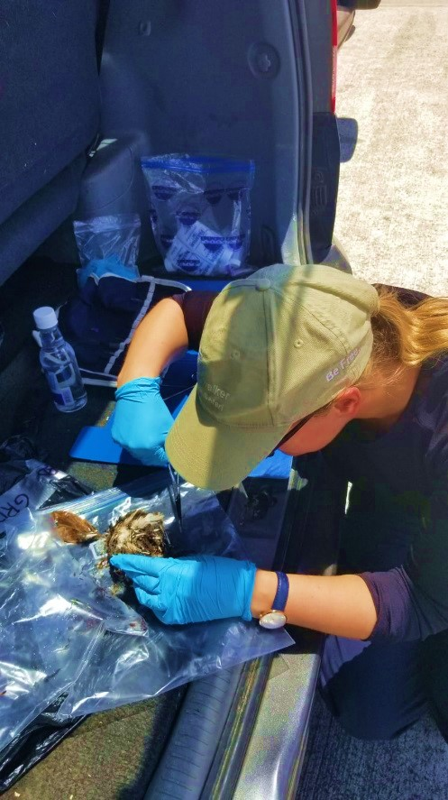



{: .floatCenter}{: height="300px" width="600px"}

### About Kate

I am a conservation geneticist studying the effects of genetic diversity at species and population level and how this information can be used to identify conservation management strategies. 

### Kate's PhD - Molecular phylogeny and genetic diversity of the critically endangered Grenada dove (<i>Leptotila wellsi</i>)

This project aims to determine the genetic status of the critically endangered Grenada dove (Leptotila wellsi) and identify conservation management recommendations which will help to ensure the long-term survival of this species.This project has assessed the usability of non-invasive samples as source for informative genetic material for critically endangered species. See publication for more information. This project is in the process of assigning the phylogenetic placement of the Grenada dove within the Columbidae phylogeny along with investigating the haplotype variation which will be used to assess inter- and intra-specific genetic diversity of the Grenada dove populations. Furthermore the impacts of land use changes and predator population sizes on the Grenada dove population will be investigated.

### Publications

__Peters C__, Nelson H, Rusk B, Muir A (2019) A novel method to optimise the utility of underused moulted plumulaceous feather samples for genetic analysis in bird conservation. Conserv Genet Resour. doi: 10.1007/s12686-019-01117-8

{: .floatCenter}{: height="300px" width="600px"}
