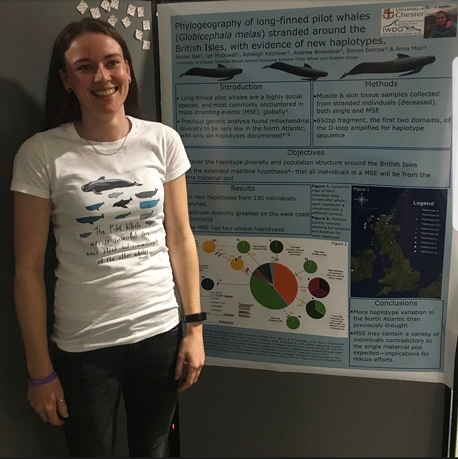



We are the Conservation Biology Research Group at the University of Chester. Our members have expertise in conservation genetics, population and landscape ecology, conservation policy and marine ecology. Our focus lies in combining these areas of research to inform the conservation of species, ecosystems and landscapes. We have projects around the globe, including Europe, the Caribbean, South East Asia and South America. However, we also maintain a local focus with conservation projects in Cheshire and North Wales as well as other locations in the UK and Ireland. 

# Academic Staff
<table border="0" align  = "center" width  = "400">
<tr>
    <td style="border: 0;"></td>
    <td style="border: 0;"></td>
    <td style="border: 0;"></td>
 </tr>
 <tr>
    <td style="border: 0;"><a href="http://mattgeary.github.io"><b>Matt Geary</b></a></td>
    <td style="border: 0;"><a href="https://www.researchgate.net/profile/Anna_Muir"><b>Anna Muir</b></a></td>
	<td style="border: 0;"><a href="https://achazhardenberg.github.io/"><b>Achaz von Hardenberg</b></a></td>
 </tr>
  <tr>
    <td style="border: 0;">I'm a conservation ecologist studying how environmental drivers cause population change in space and time.</td>
    <td style="border: 0;">I use population genetic and genomic techniques to understand the current and potential implications of anthropogenic impacts at population level, in order to form effective conservation strategies.</td>
	<td style="border: 0;">I am a conservation ecologist with broad research interests encompassing long term studies in population dynamics and life history, biodiversity monitoring and conservation as well as evolutionary and behavioural ecology.</td>
 </tr>
</table>

# Postgraduate Researchers  

## PhD Candidates

<table border="0" align  = "center" width = "400">
 <tr>
    <td style="border: 0;">
    <td style="border: 0;">
	<td style="border: 0;"></td>
 </tr>
 <tr>
    <td style="border: 0;"><a href="http://chesterconsbio.github.io/_pages/cpeters.html"><b>Kate Peters</b></a></td>
    <td style="border: 0;"><a href="http://chesterconsbio.github.io/_pages/rball.html"><b>Rachel Ball</b></a></td>
<!---><td style="border: 0;">Naomi Matthews</td>
	<td style="border: 0;">Alex Lancaster</td><--->

 </tr>
  <tr>
    <td style="border: 0;">Molecular phylogeny and genetic diversity of the critically endangered Grenada dove (<i>Leptotila wellsi</i>)</td>
    <td style="border: 0;">Novel techniques for informing conservation of difficult to observe species: Long-finned pilot whales around the British Isles. </td>
<!--->	<td style="border: 0;">Conservation Ecology of Giant Pangolin in Uganda.</td>
	<td style="border: 0;">Investigating the effects of livestock on the behaviour of guanaco in Patagonia, Southern Chile.</td> 
<--->
 </tr>
</table>

## Masters by Research

<table border="0" align  = "center" width  = "400">
 <!---><tr>
    <td style="border: 0;"></td>
    <td style="border: 0;"></td>
	<td style="border: 0;"></td>
 </tr>><--->

 <tr>
    <td style="border: 0;">Matthew Williams</td>
    <td style="border: 0;">Lottie Middleton</td>
	<td style="border: 0;">Joe Cooper</td>
	<td style="border: 0;">Jack Lawrence</td>
	<td style="border: 0;">Lorna Marcham</td>
 </tr>
  <tr>
    <td style="border: 0;">Landscape genetics of the white-faced darter dragonfly</td>
    <td style="border: 0;">Landscape genetics of the white-faced darter dragonfly</td>
	<td style="border: 0;">Conservation of Houbara Bustard on Lanzarote, Spain</td>
	<td style="border: 0;">Uptake of nestboxes by Tawny Owl in Cheshire, UK</td>
	<td style="border: 0;">Pond colonisation and conservation on the Black Isle, Scotland</td>
 </tr>
</table>
